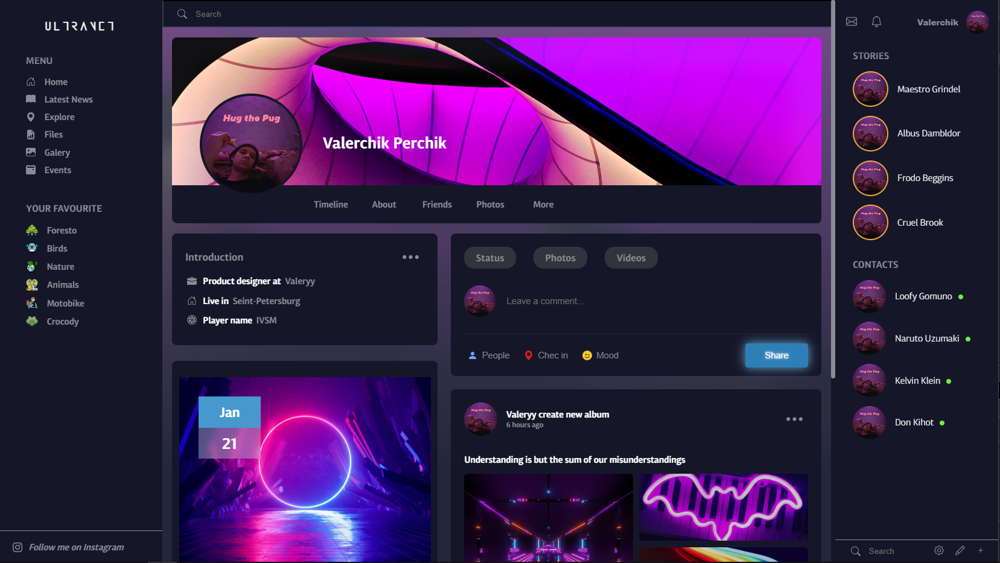

## Adaptive platform

I present my first landing!

Only rude and true(no) HTML and CSS. The whole CSS is in one file, which further complicates the layout process.

Despite the entire mess is the code, this project gave me experience at the following points: 

- what are blocks, articles, headers, footers, etc., 
- storage of a state without JS (only checkbox state), 
- adaptive design with media queries, 
- adding custom fonts
- handling with svg
- deploying on the GitHub

It was my start point in the world of frontend

*PS: The only problem that I could not solve is the integration of a custom scroll. When integrating on the page, the FLEX property broke without a clear reason, so I had to refuse this idea (the last commit in the master branch)*
	
 *Screenshot of the landing:* 

